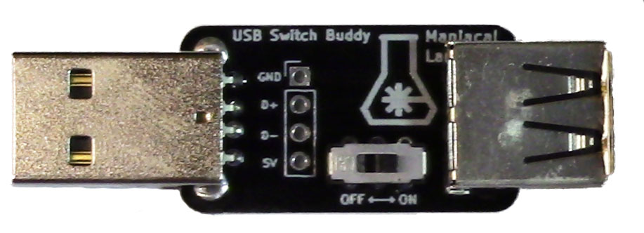
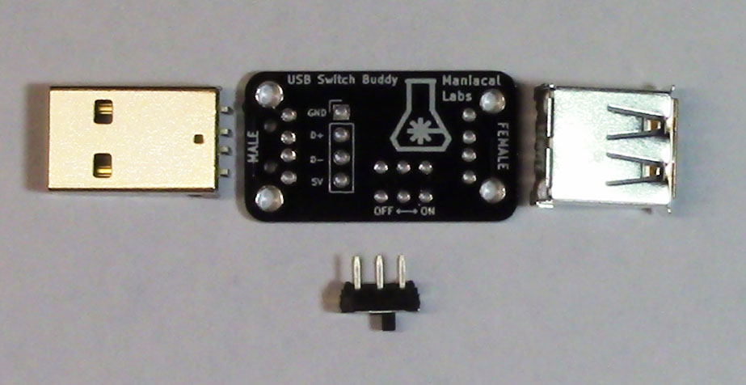
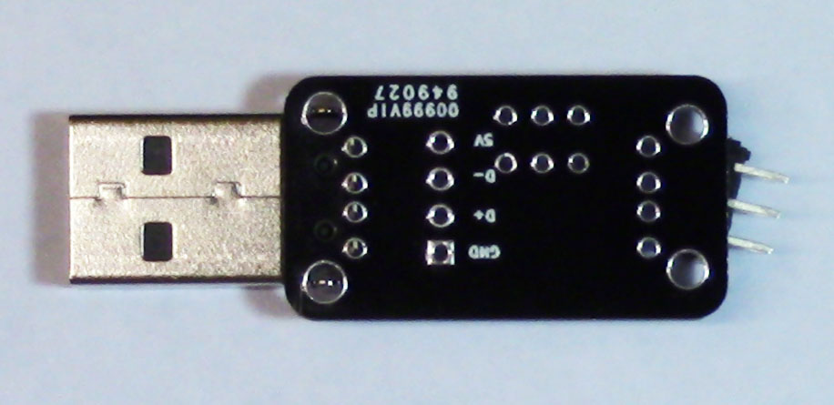
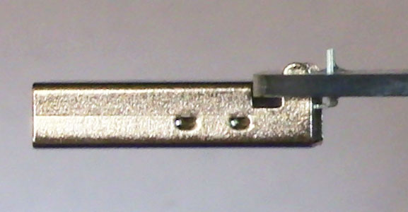
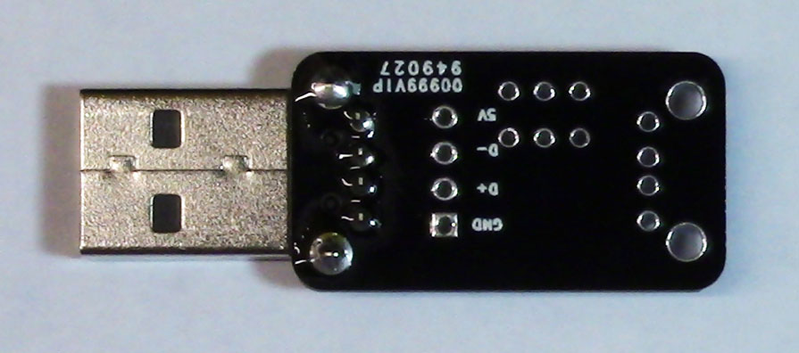
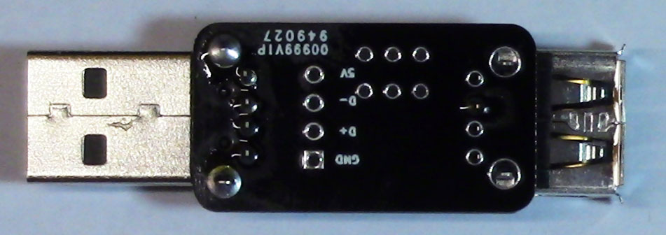
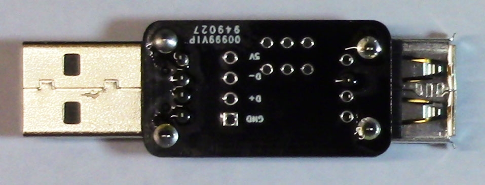
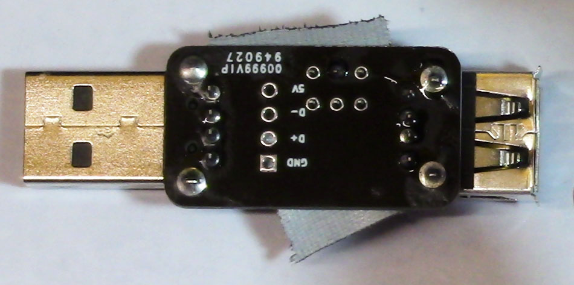
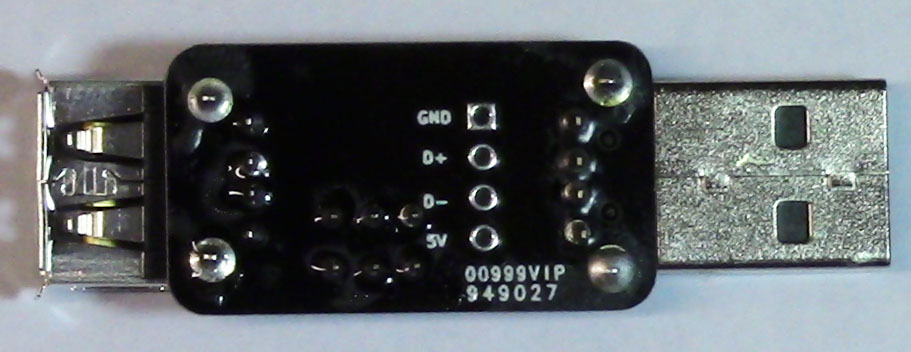
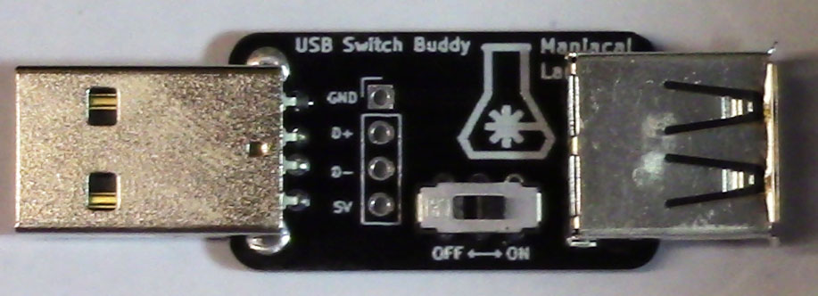

# USB Switch Buddy

The USB Switch Buddy was made to solve a simple problem: Connecting to a USB device without also powering it off the USB host.

Originally this came about with one of our 3D printers where the main control board would receive power from the Raspberry Pi running OctoPrint. The original solution was some mild surgery on a spare USB cable. But there are plenty of other situations we run into on a regular basis where this has become a problem. For example, many of our LED displays require far more power than USB can deliver, so power is provided to the micro-controller separate from the USB connection. With the USB Switch Buddy that's no longer a problem.

We considered not including a switch at all. But decided that it could come in handy, allowing you to power cycle a USB device without fully unplugging the cable. To top it all off, there's a 4-pin 0.1" header allowing you to monitor the USB line voltage and even the data lines, should you need to.

# Bill Of Materials

- [PCB](https://oshpark.com/shared_projects/nIXL0D1j)
- [Male USB Connector](https://www.mouser.com/ProductDetail/490-UP2-AH-1-TH)
- [Female USB Connector](https://www.mouser.com/ProductDetail/490-UJ2-AH-4-TH)
- [Switch](https://www.mouser.com/ProductDetail/611-JS202011CQN)

# Assembly

As there are only 4 components, including the PCB, assembly is pretty easy even for the most novice soldering skills.

**Note:** *Before beginning check if there are any small protrusions on the edge of the PCB for the male USB connector. These are a natural part of the PCB manufacturing process but in the case of the male USB connector it may need to be lightly sanded down so that edge is entirely flush.*

First connect the male USB connector where labeled. Put the connector in place and flip the board over. We've found that placing the switch on its side under the female side of the PCB is a perfect way to hold the PCB in the correct position.

Solder just one of 4 main pins and check that the connector is still flush and parallel to the PCB, like so:

Then solder the other 3 connector pins. Then solder the 2 larger posts, being sure to flow solder fully into the post holes for a strong mechanical connection.

Next, do the same with the female USB connector, soldering just one pin first:

Verify that the connector is straight and flush and, once it is, repeat the steps with all connector pins and the 2 larger posts.

Finally, if you want it, insert the switch (direction does not matter) and hold it in place with a small piece of tape. Then solder all 6 pins.

That's it! You are ready to go!

